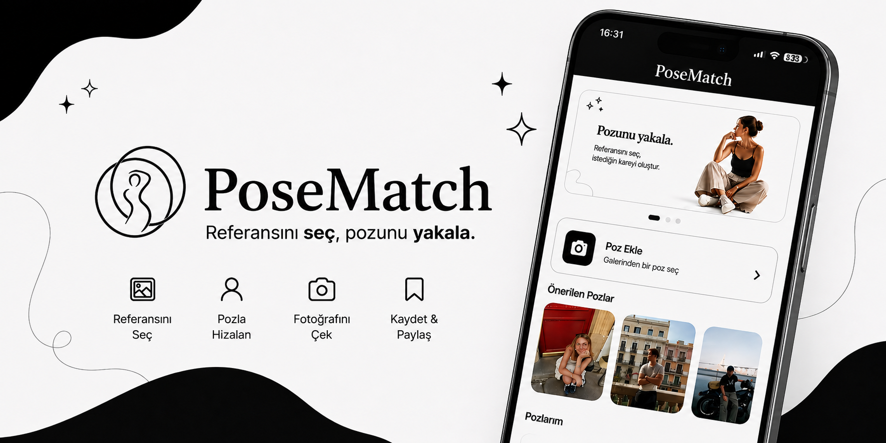

# PoseMatch

<p align="center">
  
</p>

<p align="center">
  <strong>Referansını seç, pozunu yakala.</strong>
</p>

<p align="center">
  Beğendiğin bir pozu referans al, kamera üzerinde hizalan ve kendi kareni oluştur.
</p>

---

## 📱 PoseMatch Nedir?

**PoseMatch**, kullanıcıların beğendikleri bir fotoğrafı veya pozu kendi fotoğraflarında daha kolay yeniden oluşturabilmeleri için geliştirilmiş bir mobil uygulamadır.

Pinterest, Instagram veya galerinde gördüğün bir fotoğrafı yeniden çekmek istediğinde en büyük problemlerden biri doğru **pozisyonu, açıyı ve kadrajı** yakalamaktır.

PoseMatch bu süreci basitleştirir.

Kullanıcı galeriden bir referans fotoğraf seçer ve bu görüntü kamera ekranının üzerinde ayarlanabilir bir katman olarak gösterilir. Böylece fotoğraf çekilirken referans görüntü ile kamera görüntüsü aynı anda görülebilir.

Temel kullanım akışı:

**Referansını Seç → Pozla Hizalan → Fotoğrafını Çek → Kaydet & Paylaş**

---

## ✨ Temel Özellikler

### 🖼️ Referans Fotoğraf Seçimi

Galerindeki herhangi bir fotoğrafı referans olarak kullanabilirsin.

Referans görüntü, çekmek istediğin pozun veya kompozisyonun temelini oluşturur.

---

### 📷 Kamera Üzerinde Referans Görüntü

Seçilen referans fotoğraf kamera ekranının üzerinde gösterilir.

Bu sayede:

* Pozisyonunu referans fotoğrafa göre ayarlayabilirsin.
* Kamera açısını daha kolay belirleyebilirsin.
* Kadrajı referans görüntüyle karşılaştırabilirsin.
* Fotoğrafı çeken kişi doğru kompozisyonu daha kolay yakalayabilir.

---

### ◐ Ayarlanabilir Referans Opaklığı

Referans görüntünün görünürlüğü kamera ekranındaki slider üzerinden ayarlanabilir.

Düşük opaklıkta kamera görüntüsü daha belirgin olurken yüksek opaklıkta referans görüntü daha görünür hale gelir.

Bu özellik özellikle hassas poz ve kadraj eşleştirmelerinde yardımcı olur.

---

### 🔄 Ön / Arka Kamera Desteği

Kullanıcı çekim sırasında ön ve arka kamera arasında geçiş yapabilir.

Böylece PoseMatch hem:

* Kendi fotoğrafını çekerken
* Başka biri tarafından fotoğrafın çekilirken

kullanılabilir.

---

### 📸 Fotoğraf Çekimi

Poz ve kadraj hazır olduğunda fotoğraf doğrudan PoseMatch kamera ekranından çekilebilir.

Referans görüntü yalnızca hizalama amacıyla kullanılır ve çekilen gerçek fotoğrafın üzerine eklenmez.

---

### 💾 Kaydetme

Çekilen fotoğraf cihaz galerisine kaydedilebilir.

Böylece oluşturulan kare daha sonra düzenlenebilir, paylaşılabilir veya tekrar kullanılabilir.

---

### 📤 Paylaşma

Çekilen fotoğraflar cihazın paylaşım seçenekleri kullanılarak diğer uygulamalarla paylaşılabilir.

---

### ❤️ Favori Pozlar

Beğendiğin referans pozları favorilerine ekleyerek daha sonra hızlı şekilde tekrar ulaşabilirsin.

---

### 🗂️ Pozlarım

Kendi eklediğin referans fotoğrafları **Pozlarım** bölümünde görüntüleyebilirsin.

Böylece sık kullandığın pozları tekrar tekrar galeriden seçmek zorunda kalmazsın.

---

## 🎯 PoseMatch Hangi Problemi Çözüyor?

Sosyal medyada gördüğümüz bir fotoğrafı yeniden oluşturmak çoğu zaman düşündüğümüzden daha zordur.

Fotoğrafı çeken kişiye:

> “Biraz daha aşağıdan çek.”

> “Ben fotoğraftaki kişiyle aynı yerde miyim?”

> “Telefonu biraz sağa kaydır.”

> “Fotoğraftaki açı böyle değildi.”

gibi yönlendirmeler yapmak gerekebilir.

Referans fotoğraf ile kamera görüntüsü ayrı ayrı görüntülendiğinde doğru kompozisyonu yakalamak da zorlaşır.

PoseMatch, referans görüntüyü doğrudan kamera deneyiminin bir parçası haline getirerek bu problemi çözmeyi amaçlar.

---

## 🚀 Nasıl Çalışır?

### 1. Referansını Seç

Galerinden yeniden oluşturmak istediğin fotoğrafı seç.

### 2. Kamerayı Aç

Referans görüntü kamera ekranında bir overlay olarak görüntülenir.

### 3. Pozla Hizalan

Kendini veya fotoğrafı çekilecek kişiyi referans görüntüyle hizala.

Gerekirse referans görüntünün opaklığını değiştir.

### 4. Fotoğrafını Çek

Kadraj hazır olduğunda fotoğrafı çek.

### 5. Kaydet veya Paylaş

Oluşturduğun kareyi galerine kaydet veya doğrudan paylaş.

---

## 🧭 Uygulama Akışı

```text
Splash
   │
   ▼
Onboarding
   │
   ▼
Ana Sayfa
   │
   ├── Önerilen Pozlar
   │
   ├── Pozlarım
   │
   ├── Favoriler
   │
   └── Poz Ekle
          │
          ▼
     Referans Seç
          │
          ▼
        Kamera
          │
          ├── Referans Overlay
          ├── Opaklık Ayarı
          ├── Kamera Değiştir
          └── Fotoğraf Çek
                  │
                  ▼
            Fotoğraf Önizleme
                  │
                  ├── Kaydet
                  ├── Paylaş
                  └── Yeniden Çek
```

---

## 🏗️ Mimari

PoseMatch geliştirilirken kod tabanının büyüyebilmesi ve özelliklerin birbirinden bağımsız yönetilebilmesi amacıyla **feature-first** ve **Clean Architecture prensiplerinden yararlanan** bir yapı tercih edilmiştir.

Temel katmanlar:

```text
lib/
│
├── app/
│   ├── router/
│   ├── theme/
│   └── transitions/
│
├── core/
│   ├── constants/
│   ├── services/
│   ├── utils/
│   └── widgets/
│
└── features/
    ├── splash/
    ├── onboarding/
    ├── home/
    ├── favorites/
    ├── poses/
    ├── camera/
    └── settings/
```

Her feature ihtiyaçlarına göre kendi:

```text
data/
domain/
presentation/
```

katmanlarını içerebilir.

Bu yaklaşım sayesinde UI, iş mantığı ve veri erişim süreçlerinin birbirinden ayrılması hedeflenmektedir.

---

## 🧠 State Management

Uygulamada state yönetimi için:

**Provider + ChangeNotifier**

yaklaşımı kullanılmaktadır.

Feature bazlı store yapısı sayesinde ekran durumları merkezi fakat birbirinden bağımsız şekilde yönetilebilir.

Örnekler:

```text
HomeBannerStore
PoseStore
CameraStore
CapturedPhotoStore
```

Store'lar aşağıdaki durumların yönetilmesinden sorumludur:

* Loading
* Ready
* Error
* Kamera initialization
* Kamera değiştirme
* Fotoğraf çekme
* Overlay yönetimi
* Kullanıcı pozları
* Favori durumları

---

## 🧩 Dependency Injection

Bağımlılıkların yönetimi için **GetIt** kullanılmaktadır.

Repository, data source, use case ve store bağımlılıkları merkezi dependency injection yapısı üzerinden oluşturulur.

Bu yaklaşım:

* Bağımlılık yönetimini kolaylaştırır.
* Test edilebilirliği artırır.
* Feature'lar arasındaki bağımlılığı azaltır.
* Kod tekrarını önler.

---

## 🛣️ Navigation

Sayfa yönlendirmeleri için **go_router** kullanılmaktadır.

Uygulama içerisinde:

* Splash yönlendirmesi
* Onboarding kontrolü
* Ana navigation
* Kamera ekranı
* Fotoğraf sonuç ekranı

router üzerinden yönetilmektedir.

---

## 🛠️ Kullanılan Teknolojiler

| Teknoloji          | Kullanım                   |
| ------------------ | -------------------------- |
| Flutter            | Mobil uygulama geliştirme  |
| Dart               | Ana programlama dili       |
| Provider           | State management           |
| ChangeNotifier     | Feature state yönetimi     |
| GetIt              | Dependency injection       |
| go_router          | Navigation                 |
| camera             | Kamera işlemleri           |
| image_picker       | Galeriden fotoğraf seçimi  |
| share_plus         | Fotoğraf paylaşımı         |
| shared_preferences | Lokal kullanıcı tercihleri |
| flutter_svg        | SVG asset kullanımı        |
| google_fonts       | Typography                 |
| Material 3         | UI tasarım sistemi         |

---

## 📁 Proje Yapısı

```text
pose_match/
│
├── android/
├── ios/
├── assets/
│   ├── images/
│   │   ├── banner/
│   │   ├── onboarding/
│   │   └── poses/
│   └── icons/
│
├── lib/
│   ├── app/
│   ├── core/
│   ├── features/
│   └── main.dart
│
├── test/
├── pubspec.yaml
└── README.md
```

---

## 🎨 Tasarım Yaklaşımı

PoseMatch'in arayüzünde sade ve fotoğraf odaklı bir tasarım dili kullanılmaktadır.

Ana tasarım yaklaşımı:

* Siyah & beyaz renk paleti
* Minimal UI
* Fotoğraf odaklı içerik
* Yumuşak köşeler
* Temiz tipografi
* Gereksiz görsel karmaşadan kaçınma
* Kamera deneyimini ön plana çıkarma

Amaç, kullanıcının dikkatini uygulamanın arayüzünden çok oluşturmak istediği **fotoğrafa ve poza** yönlendirmektir.

---

## 📦 Kurulum

Projeyi bilgisayarınıza klonlayın:

```bash
git clone <repository-url>
```

Proje klasörüne geçin:

```bash
cd pose_match
```

Flutter paketlerini yükleyin:

```bash
flutter pub get
```

Bağlı cihazları kontrol edin:

```bash
flutter devices
```

Projeyi çalıştırın:

```bash
flutter run
```

---

## ⚙️ Gereksinimler

Projeyi geliştirmek veya çalıştırmak için:

```text
Flutter SDK
Dart SDK
Android Studio veya VS Code
Android SDK
Xcode (iOS geliştirme için)
Fiziksel Android/iOS cihaz veya Emulator
```

gereklidir.

Kamera özelliklerinin test edilmesi için fiziksel cihaz kullanılması önerilir.

---

## 🔐 İzinler

PoseMatch'in temel özelliklerinin çalışabilmesi için platforma bağlı olarak bazı cihaz izinlerine ihtiyaç duyulabilir.

Başlıca izinler:

* Kamera erişimi
* Fotoğraf / galeri erişimi
* Medya kaydetme erişimi

İzinler yalnızca ilgili özelliklerin çalışması amacıyla kullanılmalıdır.

---

## 🔒 Gizlilik

PoseMatch'in temel çalışma mantığı cihaz üzerinde gerçekleşecek şekilde tasarlanmıştır.

Referans fotoğraflar ve çekilen fotoğraflar uygulamanın temel işlevlerini gerçekleştirmek için kullanılır.

Uygulamanın gizlilik yaklaşımının temel amacı:

**Kullanıcının fotoğrafları üzerinde kontrolün kullanıcıda kalmasıdır.**


---

## 💡 Gelecek Planları

PoseMatch'in ilerleyen sürümlerinde uygulamanın temel referans-overlay deneyiminin geliştirilmesi planlanmaktadır.

Potansiyel geliştirmeler arasında:

* Referans görüntüyü ölçeklendirme
* Referans görüntüyü taşıma
* Referans görüntüyü yatay çevirme
* Poz koleksiyonları
* Daha gelişmiş kamera kontrolleri
* Favori koleksiyonları
* Kişiselleştirilmiş referans poz önerileri

yer almaktadır.

---

## 📱 Platform

PoseMatch öncelikli olarak mobil cihazlar için geliştirilmektedir.

```text
Android    ✓
iOS        Planned / In Development
Web        —
Desktop    —
```

---

## 🎯 Proje Vizyonu

PoseMatch'in amacı yalnızca bir kamera uygulaması olmak değildir.

Uygulamanın temel fikri:

> **Bir referans fotoğrafı, çekim sırasında aktif bir kompozisyon rehberine dönüştürmek.**

Böylece kullanıcı gördüğü bir fotoğrafı yalnızca hatırlamaya çalışmak yerine referans görüntüyü doğrudan çekim sürecinin içerisinde kullanabilir.

---

## 🏷️ Slogan

<p align="center">
  <strong>Match the Pose. Capture the Shot.</strong>
</p>

<p align="center">
  Referansını seç, pozunu yakala.
</p>

---

## 📄 License

Bu proje şu anda geliştirme aşamasındadır.

Tüm hakları saklıdır.

Proje kaynak kodunun izinsiz olarak kopyalanması, dağıtılması veya ticari amaçlarla kullanılması yasaktır.

---

<p align="center">
  <strong>PoseMatch</strong>
  <br>
  Referansını seç, pozunu yakala.
</p>
